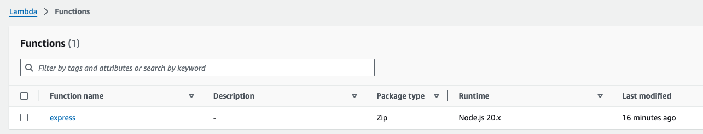
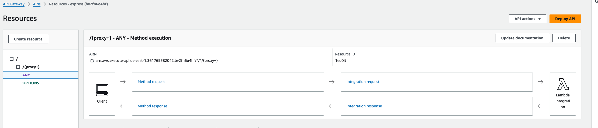
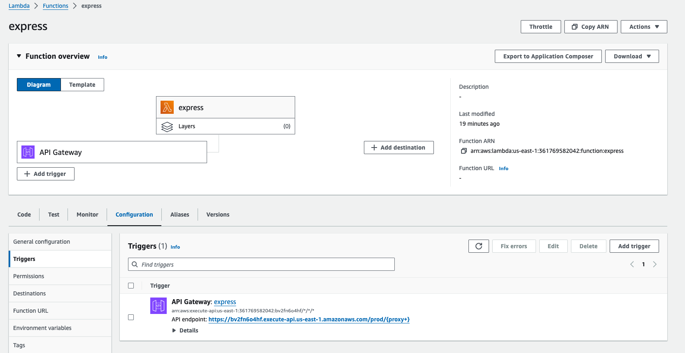

# on-man
Before delving deep in the code, highly recommend to watch the short 5 minute [video](https://youtu.be/x8hrLbfF42U) that explains and demo the application.

There are superheroes and then there is `on-man`.

`on-man` is the **Ontology Manager**, an application to manage master data for Ontology. This code repository contains:

1. NodeJS express application that has been dockerized and pushed to dockerhub
2. MySQL database that the express app connects to fetch/update/delete concepts
3. Dockerfile to package the express application into an image
4. Production ready set up validated in kubernetes cluster in local
5. Kubernetes resources under [kubernetes folder](kubernetes) that can be applied to any k8s cluster for a fully-functional application with persistent DB

## assignment progress

The progress of each of the tasks can be found here:

- [TASK 1](tasks/task1-readme.md): Implementing the business requirement as PoC
- [TASK 2](tasks/task2-readme.md): Target application architecture as a scalable solution on cloud
- [TASK 3](tasks/task3-readme.md): Proposals, Concerns and Questions

## why run on-man in local

Before getting into the section: [how to run on-man in local](https://github.com/desourav/on-man?tab=readme-ov-file#how-to-run-on-man-in-local), these are the attempts made and reasons the application was not hosted in AWS Free Tier:

Pros
- the developers would know how the microservices interact with each other even before deploying into a managed kubernetes cluster
- this setup uses `Kind` a lightweight kubernetes cluster that can be used in any computer.
- this setup mimics a kubernetes cluster and if the PoC is successful on a demo computer, all one has to do is apply the `kubernetes/*.yaml` file in the managed kubernetes cluster
- it's very quick and easy to check application logs and connect to local `mySQL` database with virtually no lag. Again, please check the [video](https://youtu.be/x8hrLbfF42U) that shows all the details of this application.

Cons
- Tried the option mentioned in the section [how to deploy using lambda function](https://github.com/desourav/on-man?tab=readme-ov-file#how-to-deploy-using-lambda-function), but the application would fetch `{"message": "Internal server error"}`
- AWS EKS doesn't have a free tier option
- Tried another option is to get AWS EC2 instance - install docker and kubernetes - apply the `kubernetes/*.yaml`. On trying this option most of the time, the free-tier env would freeze or won't respond to simple `kubectl` commands
- Although the `security groups` were added to allow `ALL` for `ssh` connection, 4/5 times the `ssh` won't work making debugging impossible.


## how to run on-man in local
**Note**: The pre-requisite is you have some variation of docker running locally. Like [Docker Desktop for Mac](https://docs.docker.com/desktop/install/mac-install/).

Run the following scripts in order mentioned below:

```
# Installs kind using brew and starts a local k8s cluster
scripts/deploy-kind.sh

# Deploys the mySQL database in the cluster and port-forwards it into `localhost:3306`
scripts/deploy-db.sh

# Configures the mySQL database
scripts/configure-db.sh

# Deploys the app and port-forwards it into `localhost:4000`
scripts/deploy-app.sh
```

Destroy everything:

```
kind delete cluster
```


## how to deploy using lambda function

1.  create a lambda function and upload the nodeJS code as zip


2. add a trigger to the lambda function
    - create a new apigateway
    - integrate it with the above
    - deploy the same

   

3. ensure the integration is mapped correctly


4. blocker
    - the url generated gives `internal server error`
    - there is no way to integrate the app with a dockerized `mySQL` database. 
    - one option could be to create a mySQL instance - point the private endpoint and credentials to the express app as env variable
    - last but not the least, completing the functional requirement with express + mySQL in the PoC was of utmost importance. If time permits one can explore the AWS offerings and deploy the setup in a managed environment with lesser point of failure.
