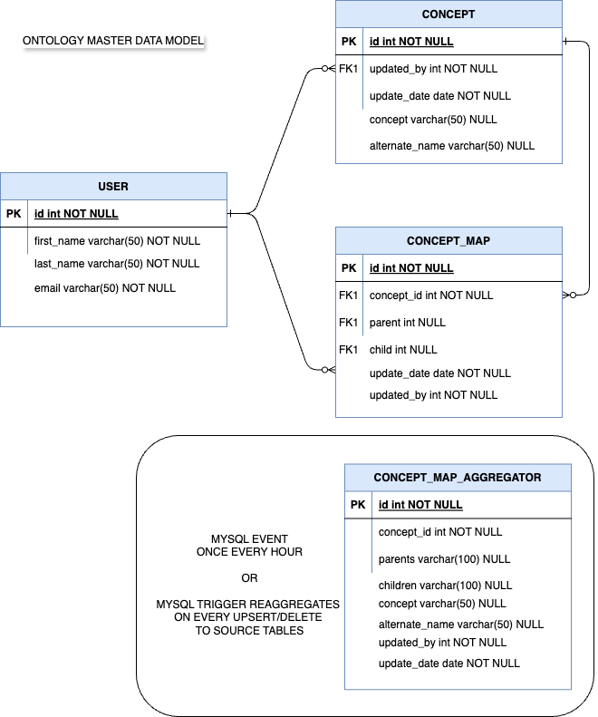

# Task 2: Target application architecture as a scalable solution on cloud

## Data model

Benefits of the data model:

- Normalizes the data for faster querying as Ontology data can grow into petabytes
- None of the data is duplicated
- Due to the inherent nature of Primary Key and Foreign Key constraints, some of the validations can be done in database 
- Aggregates the data in the backend easing the on-man application from doing heavylift in real-time. This is achieved as a scheduled job or an after-trigger upsert/delete strored procedure.

## Application architecture on cloud

Benefits of the architecture:
- Introduces the application `ON-IAM`, supports role based access using JWT token or Basic authentication
- API calls are managed using token expiry date, which makes it secure
- Adds logs to monitor user and operations performed for better visibility
- Add application load balancer to scale the application to serve higher number of users
- Connect to managed mySQL instance using kubernetes secret mounted to the application
- The data alignment is done by a new application `ON-ALIGN`, which frees `ON-MAN` from the data intensive updates to database
- API calls are tested against latency threshold using aynthetic monitoring tool such as `New Relic`
- All API calls will support `limit` and `pagination` to avoid large queries and response payloads.

